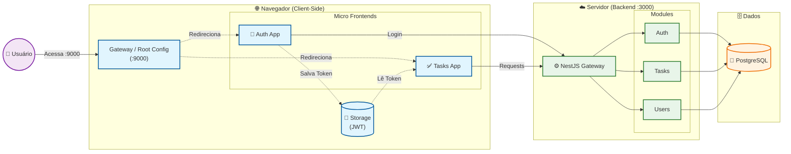

# 🏗️ Arquitetura do Sistema - TodoList V9 (Ponto Zero)

> **Versão da Arquitetura**: 0.1.0
> **Status**: Em Desenvolvimento (Base para Expansão)
> **Data**: 29/01/2026

---

## 📐 Visão Geral da Arquitetura

O sistema utiliza uma arquitetura de **Micro Frontends** (atualmente orquestrada via redirecionamento de rotas e compartilhamento de estado local) com um **Backend Monolítico Modular** (NestJS).

A separação visa permitir que equipes distintas possam trabalhar em contextos diferentes (Autenticação vs. Tarefas) de forma independente, enquanto o backend centraliza a lógica de negócios e segurança.

### Diagrama de Alto Nível

---

## 🧩 Componentes do Sistema

### 1. Root Config (`/root-config`)
*   **Função**: Ponto de entrada (Entrypoint). Atualmente atua como um "Dispatcher" que verifica a autenticação e redireciona o usuário para o Micro Frontend apropriado.
*   **Tecnologia**: HTML/JS Vanilla.
*   **Porta**: `9000`
*   **Lógica Atual**:
    *   Se `token` existe -> vai para `http://localhost:3002` (Tasks)
    *   Se `token` não existe -> vai para `http://localhost:3001` (Auth)

### 2. Auth App (`/auth-app`)
*   **Função**: Gerenciar Login, Registro e recuperação de senha.
*   **Tecnologia**: React + Vite.
*   **Porta**: `3001`
*   **Responsabilidade de Estado**: Ao logar com sucesso, salva o JWT e dados do usuário no `localStorage`.

### 3. Tasks App (`/tasks-app`)
*   **Função**: Aplicação principal de gerenciamento de tarefas.
*   **Tecnologia**: React + Vite (PrimeReact).
*   **Porta**: `3002`
*   **Responsabilidade**: Consome o token do `localStorage` para fazer requisições autenticadas.

### 4. Backend (`/backend`)
*   **Função**: API REST que serve dados e regras de negócio.
*   **Tecnologia**: NestJS + Prisma + PostgreSQL.
*   **Porta**: `3000`
*   **Design**: Modular (Modules, Controllers, Services).

---

## 🛠️ Stack Tecnológica

| Camada | Tecnologia | Motivação |
| :--- | :--- | :--- |
| **Frontend Core** | React 18 + TypeScript | Padrão de mercado, tipagem forte. |
| **Frontend Build** | Vite | Velocidade de desenvolvimento e build otimizado. |
| **UI Library** | PrimeReact + PrimeFlex | Componentes ricos prontos, agilidade na UI. |
| **Backend Framework** | NestJS | Arquitetura angular-like, injeção de dependência sólida. |
| **ORM** | Prisma | Type-safety entre App e Banco, migrações fáceis. |
| **Banco de Dados** | PostgreSQL | Relacional robusto, suporte a JSONB se necessário. |
| **Autenticação** | JWT (Passport) | Stateless, padrão para APIs REST. |
| **Estilização** | CSS Modules / Styled (via Prime) | Isolamento de estilos. |

---

## 🗺️ Mapa de Endpoints & Fluxos

### Fluxo de Autenticação

1.  **Login**: User insere credenciais no `Auth App`.
2.  **Request**: `POST http://localhost:3000/auth/login`
3.  **Response**: `{ access_token: "eyJ...", user: { ... } }`
4.  **Armazenamento**: Frontend salva em `localStorage.setItem('token', access_token)`.
5.  **Navegação**: Redirecionamento para o `Tasks App`.
6.  **Uso**: `Tasks App` anexa `Authorization: Bearer <token>` em todas as chamadas `axios`.

### Endpoints Principais (Mapeados)

#### Auth (`/auth`)
*   `POST /login` - Autenticar usuário
*   `POST /register` - Criar novo usuário (Previsto)

#### Tasks (`/tasks`)
*   `GET /` - Listar tarefas (suporta filtros)
*   `POST /` - Criar tarefa
*   `PATCH /:id` - Atualizar tarefa (status, título)
*   `DELETE /:id` - Remover tarefa

#### Users (`/users`)
*   *Endpoints a implementar para gestão de usuários.*

#### Reports (`/reports`)
*   *Endpoints a implementar para dashboards.*

---

## 🔌 Espaços para Expansão (Onde encaixar coisas novas?)

A arquitetura foi desenhada para ser extensível. Abaixo, o guia de onde implementar novas funcionalidades.

### 1. Implementar RLS (Multi-tenancy / Data Isolation)
Onde: **Backend `Prisma` & `Guards`**
*   **Banco de Dados**: O modelo `Organization` já existe no `schema.prisma`.
*   **Implementação**:
    1.  Criar um `TenancyMiddleware` ou `Interceptor` no NestJS.
    2.  Extrair `organizationId` do usuário logado (via Token).
    3.  Forçar que toda query do Prisma inclua `where: { organizationId }`.
    4.  *Alternativa RLS Nativo*: Usar Prisma Client Extensions para injetar a política de RLS a nível de query.

### 2. Página de Gerenciamento de Usuários
Onde: **Novo Módulo Frontend ou Rota no Tasks App**
*   **Simples**: Criar uma rota `/admin/users` dentro do `Tasks App` (protegida por verificação de Role `ADMIN`).
*   **Isolado**: Criar um novo Micro Frontend `admin-app` (Porta 3003) se o painel administrativo for complexo.
*   **Backend**: Expandir o `users.controller.ts` para permitir CRUD de usuários (apenas para admins).

### 3. Integração com Pagamentos
Onde: **Novo Módulo Backend + Frontend Integration**
*   **Backend**:
    *   Criar módulo `billing` (`nest g module billing`).
    *   Webhooks do Gateway (Stripe/Pagar.me) devem bater em endpoints públicos neste módulo.
*   **Frontend**:
    *   Criar tela de "Planos e Assinatura" no `Tasks App` ou `Settings`.

### 4. Dashboards Analíticos
Onde: **Reports App (Novo) ou Reports Module**
*   **Backend**: O módulo `reports` já existe. Criar serviços que fazem agregações (`count`, `groupBy`) no Prisma.
*   **Frontend**: Utilizar bibliotecas de charts (Chart.js ou Recharts) para consumir os endpoints de `/reports`. Recomendado criar uma nova rota `/dashboard` no `Tasks App`.

### 5. Criação de Novos Componentes UI
Onde: **Bibliotecas Compartilhadas**
*   Atualmente, os componentes estão duplicados ou isolados em cada app (`tasks-app/src/components` vs `auth-app/src/components`).
*   **Evolução**: Criar um pacote `shared-ui` ou `design-system` que ambos os apps consumam para manter consistência visual (Botões, Inputs, Layouts).

---

## ⚠️ Pontos de Atenção (Dívida Técnica & Melhorias)

1.  **Orquestração de Frontend**: O sistema atual usa redirecionamento (`window.location`). Para uma experiência `SPA` real (sem reload de página na troca de apps), deve-se implementar o `single-spa-react` corretamente no `root-config`, carregando os bundles JS ao invés de trocar a URL base.
2.  **Compartilhamento de Código**: Tipos (DTOs) e Componentes estão separados. Considere usar um **Monorepo Workspace** (Nx ou Turbo) para compartilhar interfaces TypeScript entre Backend e Frontend.
